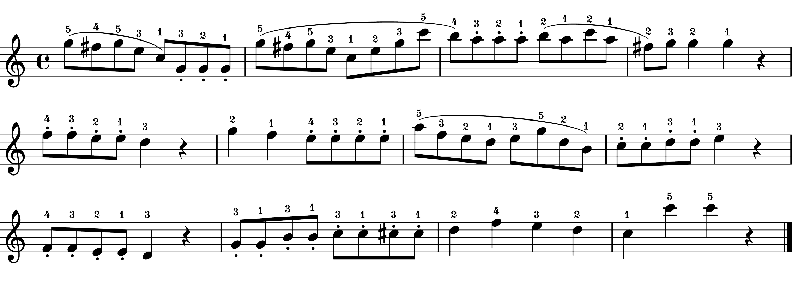

# Memo
We aim to generate artificial novices' performances by using existing data of our previous study (GitHub repo: [teaching-v2.0](https://github.com/atsukotominaga/teaching-v2.0)).

## Previous experiment

In the previous study, we created one piece based on Clementi, Sonatina in C major, op. 36 no. 3. In the experiment, participants were asked to play the piece with either articulation (i.e., stim_a) or dynamics (i.e., stim_d). In a practice session before the experiment, participants also perform the piece without expression (i.e., stim_n) in order to check whether they could perform the piece without pitch errors.

***Important!*** There were two conditions (teaching vs. performing) in the previous experiment. We only used performances from the performing condition. Therefore, selected performances do not have any didactic intention of experts.

1. No expression (stim_n)

2. Articulation (stim_a)

3. Dynamics (stim_d)

## Basic idea
We created artificial novices' recordings by **averaging** each parameter for a tempo, sound duration (articulation) and tone intensity (dynamics) across multiple performance data.

### Pre-analysis
We analysed performance data for the piece with no expression (stim_n), only articulation (stim_a) and only dynamics (stim_d) - see [analysis](https://github.com/atsukotominaga/adaptation-v1.0/tree/master/material/analysis).

1. No expression (stim_n) - baseline performance

We found some common pattern in articulation (see [duration.Rmd](https://github.com/atsukotominaga/adaptation-v1.0/blob/master/material/analysis/stim_n/duration.Rmd) in stim_n) even when participants played the piece without articulation. Therefore, we decided to use only Subject 20 and 21 who did not show such a pattern in articulation (i.e., their performances were neutral (flat) in terms of articulation). We did not conduct any statistical analysis to justify this selection.

In total, there were **31 valid performances** which had all the onsets, offsets and velocity profiles. These performance data were an original dataset of the current stimuli (see [?](?)).

2. Articulation (stim_a)

We got 137 valid performances for articulation.

3. Dynamics (stim_d)

We got ? valide performances for dynamics.

### Tempo (from IOIs)
First, we created baseline performances for the tempo. Based on the pre-analysis, a few performances were randomly selected from the dataset (random selection without replacement) and interonset intervals (IOIs) were averaged across the selected performances. We repeated this process ? times to generate ? instances.

### Articulation (from durations)
We followed exactly the same process as the tempo for articulation values.

### Dynamics (from velocity profiles)
We followed exactly the same process as the tempo for velocity values.

## Generatin stimuli (recordings)
Filtered data from [teaching-v2.0](https://osf.io/uemk5/) were used to generate stimuli.

For articulation, we used both onsets and offsets of keystrokes to determine durations of each note.
For dynamics, we used only onsets to determine velocity profiles of each note.

### Ideal performance

We will generate 16 instances for each type.

### stim_h (high)
Both articulation and dynamics are implemented correctly.

### stim_a (intermediate-articulation)
Only articulation is implemented correctly (dynamics missing).

### stim_d (intermediate-dynamics)
Only dynamics is implemented correctly (articulation missing).

### stim_l (low)
None of them is implemented (both articulation and dynamics missing).

## Selecting stimuli
After we generated the stimuli (in total 64 artificial novies' recordings), we selected 4 of each type.