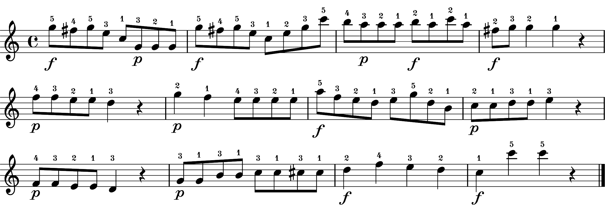

We aim to generate artificial novices' performances by using existing data of our previous study (GitHub repo: [experiment 2](https://github.com/atsukotominaga/music-teaching/tree/main/experiment-2)).

# previous experiment

In the previous study, we created one piece based on Clementi, Sonatina in C major, op. 36 no. 3. In the experiment, participants were asked to play the piece with either articulation (stim_a) or dynamics (stim_d). In the practice session before the experiment, participants also performed the piece without expression (stim_n) in order to check whether they could perform the piece without pitch errors.

***Important!*** There were two conditions (teaching vs. performing) in the previous experiment. We only used performances from the **performing** condition. Therefore, selected performances do not have any didactic intention of expert pianists.

1. No expression (stim_n)

2. Articulation (stim_a)

3. Dynamics (stim_d)

# pre-analysis
- `analysis` folder

We analysed performance data for the piece with no expression (stim_n), only articulation (stim_a) and only dynamics (stim_d) - see [analysis](https://github.com/atsukotominaga/adaptation-v1.0/tree/master/material/expstimuli/analysis).

1. No expression (stim_n) - baseline performance

We got **31 valid performances** which had all the onsets, offsets and velocity profiles.

We found some common patterns in articulation (see [duration.Rmd](https://github.com/atsukotominaga/adaptation-v1.0/blob/master/material/expstimuli/analysis/stim_n/duration.Rmd) in stim_n) even when participants played the piece without articulation. Therefore, we decided to use **only Subject 20 and 21** who did not show such a pattern in articulation (i.e., their performances were neutral (flat) in terms of articulation) for generating articulation values. We did not conduct any statistical analysis to justify this selection.

2. Articulation (stim_a) - articulation-implemented performance

We got **137 valid performances** for articulation.

3. Dynamics (stim_d) - dynamics-implemented performance

We got **139 valid performances** for dynamics.

# generating stimuli
- `original` folder

We created artificial novices' recordings by **averaging** each parameter for tempo (IOIs), articulation (sound duration) and dynamics (key velocity) across multiple performances - see [averaging](https://github.com/atsukotominaga/adaptation-v1.0/tree/master/material/stimuli/averaging).

We had 4 different types of recordings (each has 16 instances):
1. low: neither articulation nor dynamics implemented
2. intermediate-articulation: only articulation implemented
3. intermediate-dynamics: only dynamics implemented
4. high: both articulation and dynamics implemented

## 1. Low
Corresponding sheet music: stim_n

None of them is implemented (both articulation and dynamics missing).

### Tempo (from IOIs)
First, we created baseline performances for the tempo. 3 performances out of 31 performances were randomly selected from the dataset and interonset intervals (IOIs) were averaged across the 3 performances. Due to the size of the dataset (i.e., only 31 performances), some performances were used twice.

We confirmed that the identical performance was not selected within each random selection.

### Articulation (from durations)
We used only Sub20 and 21 for the reason above. We followed exactly the same process as the tempo for duration values.

### Dynamics (from velocity profiles)
We followed exactly the same process as the tempo for velocity values.

## 2, 3. Intermediate (articulation/dynamics)
Corresponding sheet music: stim_a/stim_d

### Tempo
We used exactly the same timestamps generated for low performances for both intermediate-articulation/dynamics.

### Articulation 
We followed exactly the same averaging process for duration values as we did for the tempo in low performances for intermediate-articulation performances.  
We used exactly the same velocity values generated for low performances.

### Dynamics
We followed exactly the same averaging process for velocity values as we did for the tempo in low performances for intermediate-dynamics performances.  
We used exactly the same duration values generated for low performances.

## 4. High
Corresponding sheet music: stim_m

Both articulation and dynamics are implemented correctly.

### Tempo
We used exactly the same timestamps generated for low performances.

### Articulation 
We used exactly the same duration values generated for intermediate-articulation performances.

### Dynamics
We used exactly the same velocity values generated for intermediate-dynamics performances.

- `practice` folder

We randomly selected one performance from each category (non-expressive, articulation-performing, dynamics-performing) for practice trials.

## 5. export stimuli as mid files
- `mid_export.py`

After generating stimuli (txt files), export them as mid files using mid_export.py. >> **output**: mid folder

# selecting stimuli
- `selected` folder

Based on the results of the pilot rating (`../prerating/data/summary.Rmd`), we selected 4 stimuli for each type.

- `IOI`: 4 base tempi were randomly selected from the original 16 instances (see details: `IOI/ioi_onset.Rmd`)
- `combine.R`: based on what were selected (`../prerating/data/selected_1612309984-030221.txt`), create 4 stimuli for eacy type.

# tweaked stimuli
- `tweaked` folder

For dyn_only and low stimuli, it seems the KOT values are too close to the staccato range. We calculated the difference between the mean of each stimulus and the grand mean of art_only and high stimuli and add that difference to all KOT values for dyn_only and low, so that the KOT values should shift closer to the grand mean of art_only and high stimuli.

# Rename stimuli for the experiment
- art_only_1 ~ art_only_4 -> 1 ~ 4
- dyn_only_1 ~ dyn_only_4 -> 5 ~ 8
- high_1 ~ high_4 -> 9 ~ 12
- low_1 ~ low_4 -> 13 ~ 16