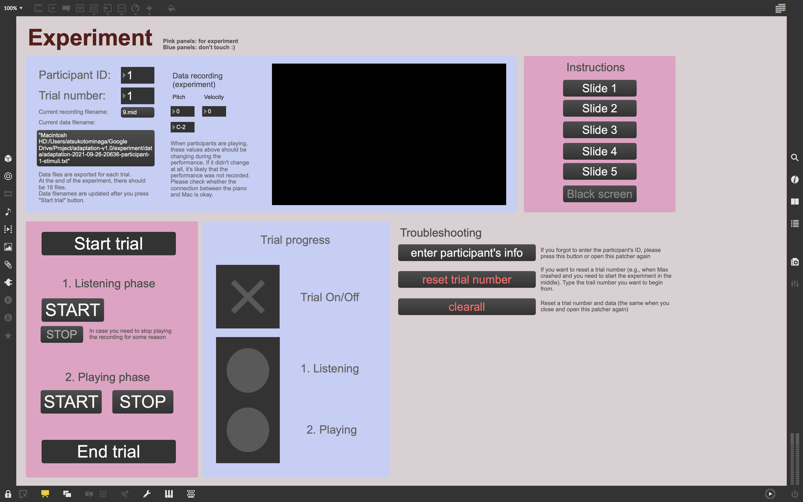

<head>
<title>Instruction</title>

# Instruction
Author: Atsuko Tominaga - 26/09/2021 (adaptation-v1.0)

# Equipments
1. MacBook Pro (Music Lab)
2. Audio interface
3. 2 headphones
4. Digital piano + chair
5. Type-C converter
6. iPad
7. DELL monitor

# PARTICIPANT RECRUITMENT:

- Pianists who are currently studying piano performance/teaching at music school / have already had a degree in piano performance/teaching
- Basic English skills

# BEFORE PARTICIPANT ARRIVES:
- Turn off WiFi connection

## Devices
Adjust the volume of the headphone so that it sounds naturally.

- Setups

Overall

Digital piano

MacbookPro

Audio interface (Focusrite)

## Max
1. Go to **Desktop -> adaptation-v1.0 -> open the "check.maxpat"** on this laptop and enter participant's ID.

Note: Start from 1 (not 01) to 20, 30 etc..

2. Open the “display.maxpat”**. Move the window of the “display.maxpat” to the right (on the screen in front of the piano”) and press F for a fullscreen mode. If there is a toolbar surrounding the display, get rid of it by pressing command+8 (not F8).
3. Check whether the piano sounds come from the headphone.
4. If the sound of the metronome and the piano does not come from the computer speaker, go to **System Preference -> Sound -> Output -> select “Scarllet 6i6 USB”**.
5. If you cannot still solve the problem above, please quit Max and relaunch it again.

### Pre/post-check Patch (check.maxpat)

- How to give instructions
  + `Slide 1`, `Slide 2`

- How to start a trial
1. `Start trial`
2. `START` - playing phase (start recording)
3. `STOP` - playing phase (stop recording)
4. `End trial`

### Experiment Patch (experiment.maxpat)

- How to give instructions
  + `Slide 1`, `Slide 2`, `Slide 3`, `Slide 4`, `Slide 5`
  
- How to start a trial
1. `Start trial`
2. `START` - listening phase
3. `START` - playing phase (start recording)
4. `STOP` - playing phase (stop recording)
5. `End trial`

# WHEN PARTICIPANT ARRIVES:

- *Italic*: Verbal instruction
- >: **What to do**
- Please use a checklist to make sure you don't forget each procedure.

## Introduction
*Thank you for participating in the experiment. The aim of the experiment is to investigate how people play a piece of music expressively. The experiment is going to last about one hour.*

*If you have any questions or concerns, please ask the experimenter at any time about the nature of the study or the methods we are using. Also, you have the right to withdraw from the experiment at any time.*

*Before we start the experiment, please read the information sheet carefully and fill it out if you agree to take part in the study.*

> **Collect the informed consent form**

## 0. Warm-up session
*Now, you are going to play what you practised during the experiment. Before we start testing, I would like you to practise your favourite pieces / exercises so that you can get used to the digital piano. I am going to leave the room, so when you think that you can comfortably perform music with this piano, please let me know.*

> **Experimenter can leave the room / Let participants practise their favourite pieces alone**

## 1. Pre-check session
> **Open check.maxpat**

Read instructions on `Slides 1-2` aloud.

> **1 - 2 trials**

> **Close check.maxpat**

## 2. Experiment
> **Open experiment.maxpat**
> **Enter participant's ID**

Read instructions on `Slides 1-5` aloud.

Some notes:
- Playing phase: performances are only recorded after the metronome beats! If participants, start playing before or during the metronome, please ask them to play after it.

Definition of musical expressive techniques (based on Wikipedia):

- Legato: musical notes are played smoothly and connected
- Staccato: musical notes have shortened duration and are separated from each other
- Forte: louder sound
- Piano: quieter sound

> **1 - 16 trials**

> **Close experiment.maxpat**

## 3. Post-check session
> **Open check.maxpat**

Read instructions on `Slides 1-2` aloud.

> **1 - 2 trials**

> **Close check.maxpat**

## 4. Questionnaire

*Thank you. This is the end of the experiment. Lastly, could you please fill in the questionnaire?*

> **Collect the short questionnaire**

## DEBRIEFING (!!! Don't forget !!!)
*This is the end of the experiment. The experiment was conducted to investigate whether and how pianists modulate their performance depending on the skill level of students. The recordings that you listened to were actually not from students, but artificially created to manipulate the different skill levels. Do you have any question about the experiment?*

*Thank you for coming today and please feel free to contact us anytime if you have any questions about our study.*

# AFTER PARTICIPANT LEAVES:
1. Check whether data were recorded correctly. If not, leave a memo on the checklist. Don't delete any file.

### Where is the data folder?
- `data`: text files
- `mid`: midi files (recordings)

### How is each file named?
adaptation-year-month-day-time-participantID-block-stimuli.txt/mid

- Example in data folder:
  - adaptation-2021-09-21-10275-1-8-3.txt
  - pre-2021-09-21-12394-1-8-3.txt

At the end of the experiment, there should be at least:
  - 16 files starting with "adaptation"
  - 2 files starting with "pre"
  - 2 files starting with "post"

1. Quit Max.
2. Turn off the piano, the audio interface and the screen in front of the piano.

# Notes
- If participants ask whether they can use different fingerings, please let them know that they can play as they like.
- If participants ask whether they should keep the tempo or not, please let them know that they can play as they like, but keep in mind the metronome tells you the original tempo of this piece.
- If participants ask anything related to detailed information about each skill (e.g., deeper legato? normal/subito forte?), just ask them to play as they like.
- If participants start playing before the metronome beats, please record the same trial again.

</head>