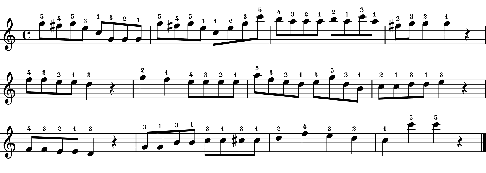

# Memo
We aim to generate artificial novices' performances by using existing data of our previous study (GitHub repo: [teaching-v2.0](https://github.com/atsukotominaga/teaching-v2.0)).

# Overview
- [Previous experiment](#previous-experiment)
- [Pre-analysis](#pre-analysis) ([analysis](https://github.com/atsukotominaga/adaptation-v1.0/tree/master/material/stimuli/analysis))
- [Generating stimuli](#generating-stimuli) ([averaging](https://github.com/atsukotominaga/adaptation-v1.0/tree/master/material/stimuli/averaging))
- [Export stimuli as mid files](#export-stimuli-as-mid-files)

# Previous experiment

In the previous study, we created one piece based on Clementi, Sonatina in C major, op. 36 no. 3. In the experiment, participants were asked to play the piece with either articulation (stim_a) or dynamics (stim_d). In a practice session before the experiment, participants also performed the piece without expression (stim_n) in order to check whether they could perform the piece without pitch errors.

***Important!*** There were two conditions (teaching vs. performing) in the previous experiment. We only used performances from the **performing** condition. Therefore, selected performances do not have any didactic intention of experts.

1. No expression (stim_n)

2. Articulation (stim_a)

3. Dynamics (stim_d)

# Pre-analysis
We analysed performance data for the piece with no expression (stim_n), only articulation (stim_a) and only dynamics (stim_d) - see [analysis](https://github.com/atsukotominaga/adaptation-v1.0/tree/master/material/stimuli/analysis).

1. No expression (stim_n) - baseline performance
> [Filtered data](https://github.com/atsukotominaga/adaptation-v1.0/blob/master/material/analysis/stim_n/preprocessor/filtered) were used to generate stimuli.

We got **31 valid performances** which had all the onsets, offsets and velocity profiles.

We found some common patterns in articulation (see [duration.Rmd](https://github.com/atsukotominaga/adaptation-v1.0/blob/master/material/analysis/stim_n/duration.Rmd) in stim_n) even when participants played the piece without articulation. Therefore, we decided to use **only Subject 20 and 21** who did not show such a pattern in articulation (i.e., their performances were neutral (flat) in terms of articulation) for generating articulation values. We did not conduct any statistical analysis to justify this selection.

2. Articulation (stim_a) - articulation-implemented performance

> [Filtered data](https://github.com/atsukotominaga/adaptation-v1.0/blob/master/material/analysis/expression/filtered) were used to generate stimuli.

We got **137 valid performances** for articulation.

3. Dynamics (stim_d) - dynamics-implemented performance

> [Filtered data](https://github.com/atsukotominaga/adaptation-v1.0/blob/master/material/analysis/expression/filtered) were used to generate stimuli.

We got **139 valid performances** for dynamics.

# Generating stimuli
We created artificial novices' recordings by **averaging** each parameter for a tempo, sound duration (articulation) and tone intensity (dynamics) across multiple performances- see [averaging](https://github.com/atsukotominaga/adaptation-v1.0/tree/master/material/stimuli/averaging).

We want to create 4 different types of recordings:
1. low: neither articulation nor dynamics implemented
2. intermediate-articulation: only articulation implemented
3. intermediate-dynamics: only dynamics implemented
4. high: both articulation and dynamics implemented

## 1. Low
Corresponding sheet music: stim_n

None of them is implemented (both articulation and dynamics missing).

### Tempo (from IOIs)
First, we created baseline performances for the tempo. Based on the pre-analysis, 3 performances were randomly selected from the dataset (random selection without replacement) and interonset intervals (IOIs) were averaged across the 3 performances. Because of the size of the dataset (i.e., only 31 performances), some performances were used twice.

We confirmed that the identical performance was not selected within each random selection.

### Articulation (from durations)
We used only Sub20 and 21 for the reason above.

### Dynamics (from velocity profiles)
We followed exactly the same process as the tempo for velocity values.

## 2, 3. Intermediate (articulation/dynamics)
Corresponding sheet music: stim_a/stim_d

### Tempo
We used exactly the same timestamps generated for low performances for both intermediate-articulation/dynamics.

### Articulation 
We followed exactly the same process for articulation values as we did for the tempo in low performances for intermediate-articulation performances.  
We used exactly the same articulation values generated for low performances for intermediate-dynamics.

### Dynamics
We used exactly the same velocity values generated for low performances for intermediate-articulation.
We followed exactly the same process for dynamics values as we did for the tempo in low performances for intermediate-dynamics performances.  

## 4. High
Corresponding sheet music: stim_m (see below)

Both articulation and dynamics are implemented correctly.

### Tempo
We used exactly the same timestamps generated for low performances.

### Articulation 
We used exactly the same articulation values generated for intermediate-articulation performances.

### Dynamics
We used exactly the same velocity values generated for intermediate-dynamics performances.

# Export stimuli as mid files
After generating stimuli (txt files), export them as mid files using mid_export.py. >> **output**: mid folder